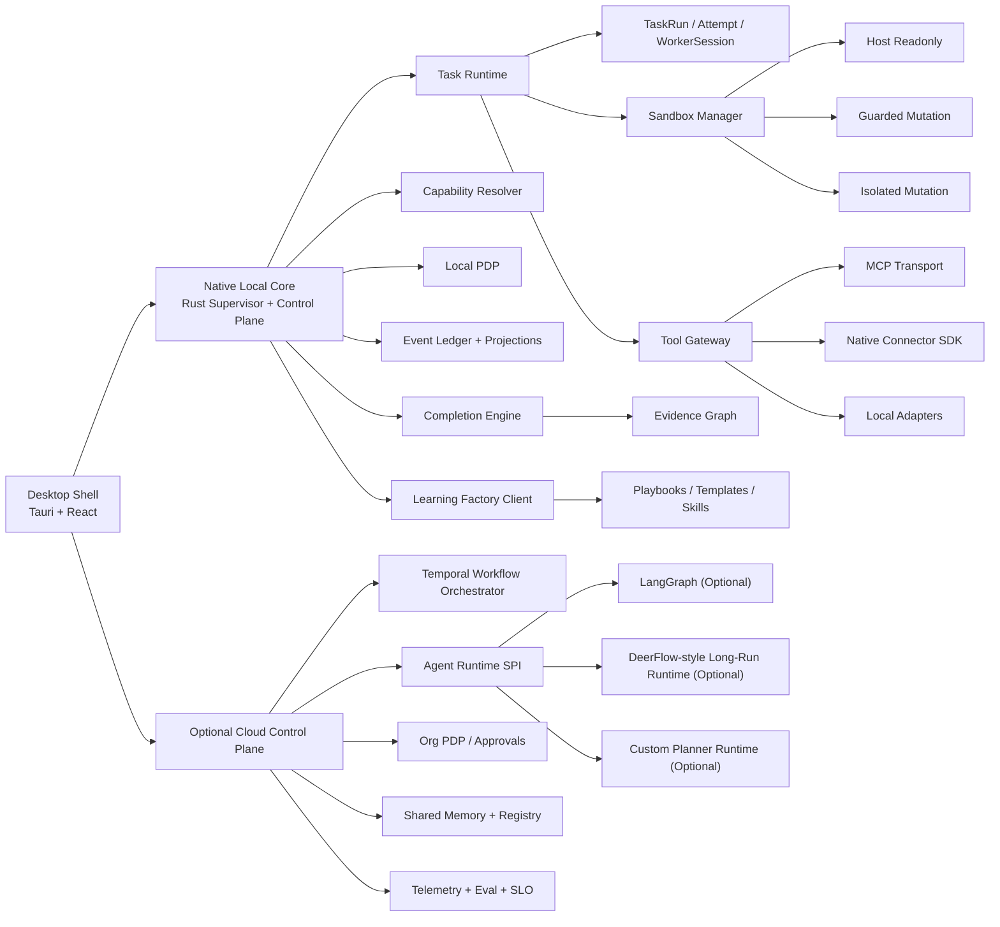

# Best-Practice Architecture Reset Plan

This document answers a narrower question than `../master_plan.md`:

`If Apex were optimized for best practice from today forward, without preserving backward compatibility, what should change?`

Use this document when:

- reviewing whether the current target plan is strong enough
- deciding which architectural choices should be replaced rather than incrementally patched
- planning a non-compatibility-constrained redesign toward a more durable final system

Important boundary:

- `../master_plan.md` remains the canonical product plan
- this document is the canonical best-practice override for parts of that plan that are still "good direction" but not yet the strongest engineering shape
- `./current-architecture-status.md` still describes what is actually implemented now
- `./architecture-document-system.md` defines the authority order and vocabulary discipline for interpreting these documents together

## 1. Executive Summary

The current architecture direction is strong in:

- local-first execution
- verification-first completion
- governed learning and reuse
- policy and audit awareness
- vendor neutrality

The main places where it is not yet best practice are:

- the local desktop runtime still tolerates a Node-companion end state instead of converging on a native control core
- the future cloud orchestrator is described too loosely as `Temporal + LangGraph`, which is directionally useful but not a clean boundary
- the delegated runtime contract chain is too granular for a stable product surface
- persistence is described mostly as entity storage rather than as an operational ledger plus projections
- hard sandboxing is still framed as a later hardening step rather than a first-class execution tier
- capability discovery is still documented as a precedence ladder instead of a scored resolver
- learning promotion is not yet defined as an eval-backed release system
- observability is still documented mostly as dashboards and metrics rather than a full traceable run graph with SLOs

The best-practice reset therefore keeps the current product philosophy, but replaces several architectural choices with a stricter target shape.

## 2. What Is Not Yet Best Practice

### 2.1 Local Control Plane End State

Current direction that is not best practice:

- a packaged desktop companion can still end up depending on a portable Node runtime
- policy, permission, and machine-control authority can remain too close to a JavaScript service boundary

Why this is not best practice:

- desktop authority, local permissions, and audit-critical execution should live in the most tightly controlled runtime
- bundling a portable Node runtime is acceptable as a transition tactic, but it is not the strongest end state for a security-sensitive universal desktop agent
- it increases packaging weight, signing complexity, runtime drift, and the attack surface of the privileged local core

Best-practice replacement:

- move the local control plane, permission enforcement, checkpoint ledger, and task supervisor into a native `Rust` core
- treat JavaScript, Python, browser, and specialist agent runtimes as isolated worker payloads rather than as the privileged operating core
- keep the desktop shell on `Tauri + React`, but make the privileged sidecar a native process with stable FFI or HTTP/IPC contracts

### 2.2 Cloud Orchestrator Boundary

Current direction that is not best practice:

- the cloud orchestrator is described as `Temporal + LangGraph`

Why this is not best practice:

- it collapses two different concerns into one named box
- `Temporal` is a durable workflow engine
- `LangGraph` is one possible agent-graph implementation
- treating them as co-equal architecture primitives obscures replaceability and ownership boundaries

Best-practice replacement:

- define a `Cloud Workflow Orchestrator` boundary owned by `Temporal`
- define a separate `Agent Runtime SPI` behind that boundary
- allow `LangGraph`, DeerFlow-derived planners, or a custom planner runtime to implement that SPI without becoming the architecture itself
- keep `LangGraph` optional and pluggable rather than mandatory

### 2.3 Delegated Runtime Modeling

Current direction that is not best practice:

- the delegated runtime chain is described through many public concepts such as launcher, driver, adapter, backend execution, runner handle, runner execution, and runner job

Why this is not best practice:

- it overexposes internal execution plumbing
- it increases API surface area, cognitive load, migration cost, and UI coupling
- it makes the system harder to reason about, because not every internal stage deserves first-class product semantics

Best-practice replacement:

- simplify the public execution model to:
  - `TaskRun`
  - `TaskAttempt`
  - `WorkerSession`
  - `SandboxLease`
  - `ExecutionStep`
  - `VerificationRun`
- keep launcher, adapter, driver, and process/job details internal to the runtime and expose them only through diagnostics or trace metadata
- treat the product API as command/query oriented, not as a mirror of every runtime sub-layer

### 2.4 Persistence Architecture

Current direction that is not best practice:

- persistence is mainly framed as entity tables behind a repository boundary

Why this is not best practice:

- agent systems need both current state and a durable causal history
- entity-only storage makes replay, audit, incident reconstruction, retry safety, and synchronization harder
- learning, verification, and governance all benefit from immutable evidence streams

Best-practice replacement:

- adopt an `append-only operational event ledger` plus `materialized state projections`
- keep local-first storage on `SQLite` because it is still the best default for an embedded desktop runtime
- add:
  - append-only event journal
  - outbox/inbox tables
  - read-optimized projections for workspace UI
  - object-backed artifact store
  - `MemoryDirectory` and `MemoryDocument` registries as the human-readable system of record for durable knowledge
  - bounded semantic index as an augmentation layer, not the system of record
  - hierarchical retrieval that uses direct addressing and metadata filters before semantic discovery
- in cloud mode, use `Postgres` for durable control-plane state and workflow projections, plus object storage for artifacts

### 2.5 Sandboxing and Isolation

Current direction that is not best practice:

- stronger sandboxing is still described as future hardening

Why this is not best practice:

- risky agent execution is not a polishing concern
- it is part of the core trust model
- file mutation, shell mutation, browser automation, and untrusted skill execution should not all share one host-level trust boundary

Best-practice replacement:

- define three execution tiers from day one:
  - `host_readonly`
  - `guarded_mutation`
  - `isolated_mutation`
- route high-risk execution only through isolated runners
- isolated runners should support:
  - scoped filesystem mounts
  - short-lived capability tokens
  - CPU / memory / wall-clock quotas
  - network egress policy
  - signed execution manifests
- use OS-native isolation where possible and a dedicated sandbox runner pool where stronger boundaries are required

### 2.6 Capability Discovery

Current direction that is not best practice:

- capability discovery is documented as a mostly fixed precedence ladder

Why this is not best practice:

- a simple search order is explainable, but it is too weak for a universal agent platform
- best capability choice depends on:
  - safety
  - reliability
  - latency
  - cost
  - data locality
  - historical success
  - policy fit

Best-practice replacement:

- introduce a `Capability Resolver` that scores candidates across:
  - policy admissibility
  - risk tier
  - locality
  - deterministic coverage
  - historical reuse success
  - latency class
  - cost class
- keep the old precedence order only as a tiebreaker, not as the full decision rule

### 2.7 Verification Architecture

Current direction that is not best practice:

- the completion stack is described as a mostly linear `checklist -> verifier -> reconciliation -> done gate` path

Why this is not best practice:

- that ordering is useful for explanation, but production verification should be evidence-driven rather than purely sequential
- some deterministic checks and reconciliation checks can run in parallel
- semantic verification should consume the evidence graph, not just the final output blob

Best-practice replacement:

- introduce an `Evidence Graph`
- store:
  - required outputs
  - execution evidence
  - external state confirmations
  - policy decisions
  - verifier findings
- let the `Completion Engine` evaluate the full evidence graph
- keep:
  - deterministic validators
  - reconciliation engine
  - verifier agent
  - final done gate
- but model them as independent evidence producers feeding one completion decision

### 2.8 Learning and Self-Evolution

Current direction that is not best practice:

- successful tasks can promote learned assets after verification, but the promotion path is still relatively direct

Why this is not best practice:

- learned methods can drift
- one good run is not always enough for broad reuse
- reuse systems need release discipline, not just capture discipline

Best-practice replacement:

- establish a `Learning Factory` with stages:
  1. distill
  2. sanitize
  3. cluster and deduplicate
  4. replay eval
  5. policy review
  6. canary adoption
  7. general promotion
  8. rollback if regression is detected
- treat new or changed playbooks as versioned release artifacts with eval history
- feed user feedback, verifier misses, rollback events, and repeated overrides back into the learning backlog

### 2.9 API and Product Surface

Current direction that is not best practice:

- some docs expose a very large number of low-level lifecycle endpoints

Why this is not best practice:

- stable product APIs should expose user and operator intent
- internal orchestration stages should stay private unless they materially affect recovery, review, or compliance

Best-practice replacement:

- split runtime interfaces into:
  - `Commands`
  - `Queries`
  - `Events`
- public commands should express business intent such as:
  - create task
  - approve action
  - stop task
  - retry attempt
  - promote playbook
  - release sandbox lease
- private execution plumbing should remain inside runtime services and traces

### 2.10 Observability and Operations

Current direction that is not best practice:

- observability is documented mainly as dashboards, logs, and metrics

Why this is not best practice:

- agent systems need causal tracing across planning, tool use, verification, approvals, and learning promotion
- metrics alone cannot explain why the system made a specific decision or where an omission occurred

Best-practice replacement:

- make `OpenTelemetry-style tracing` and correlated event ids first-class
- every task run should produce:
  - run timeline
  - span tree
  - evidence graph
  - cost breakdown
  - policy decision trail
- define SLOs for:
  - task completion latency
  - verification latency
  - false-completion escape rate
  - sandbox failure rate
  - fallback rate
  - reuse precision

### 2.11 Scheduler and Long-Running Execution

Current direction that is not best practice:

- scheduling is still positioned as a baseline capability with partial durability

Why this is not best practice:

- recurring and scheduled agent work requires explicit ownership of retries, deduplication, and missed-run recovery

Best-practice replacement:

- define a dedicated `Automation Service`
- separate:
  - schedule definition
  - trigger production
  - run deduplication
  - missed-run recovery
  - recurrence policy
- in cloud mode, let the workflow engine own durable scheduling
- in local-only mode, keep a bounded embedded scheduler with the same contracts

### 2.12 Policy Architecture

Current direction that is not best practice:

- policy is already strong, but it is still described mostly as scoped files and approval flows

Why this is not best practice:

- best-practice policy systems separate decision and enforcement
- they also distinguish operational policy, connector policy, model policy, and learning-promotion policy

Best-practice replacement:

- formalize:
  - `PDP`
    - policy decision point
  - `PEP`
    - policy enforcement points
- local tool gateway, sandbox runner, scheduler, completion engine, and learning factory should all act as PEPs
- local or cloud policy services can act as PDPs depending on mode

### 2.13 Long-Run Autonomy

Current direction that is not best practice:

- unattended long-run completion is implied, but not yet elevated into a first-class runtime contract

Why this is not best practice:

- a universal agent platform should not require constant human babysitting
- long tasks need self-healing, watchdogs, and bounded fallback behavior

Best-practice replacement:

- define `Autonomous Completion` as a core runtime property
- require every long-running task family to support:
  - heartbeat
  - checkpoint recovery
  - bounded retry policy
  - circuit breaker behavior
  - watchdog escalation
  - explicit human-judgment boundaries
- keep the runtime working until:
  - the definition of done is satisfied
  - the user stops the task
  - policy blocks the task
  - a real human judgment boundary is reached

### 2.14 Deterministic Infrastructure Hierarchy

Current direction that is not best practice:

- the product strongly values reuse, but it does not yet state a strict deterministic-first hierarchy clearly enough

Why this is not best practice:

- many operational workflows should not consume model reasoning at all once they are well understood
- without a hard hierarchy, teams gradually overuse LLMs for fixed workflows

Best-practice replacement:

- make the execution hierarchy explicit:
  1. CLI
  2. script
  3. reusable tool or connector
  4. reusable skill that wraps deterministic infrastructure
  5. LLM reasoning path
- treat `CLI + scripts` as core infrastructure
- treat `skills` as the layer that binds method to infrastructure
- treat the LLM as the planner, synthesizer, and exception handler rather than the default executor
- allow periodic consolidation of CLI and skill assets only when it is:
  - opt-in
  - budget-capped
  - reviewable
  - compact

### 2.15 Cross-Platform Computer Control

Current direction that is not best practice:

- local machine control is present, but the final target is still too adapter-centric and not yet explicit enough about full cross-platform tool discovery and use

Why this is not best practice:

- the platform must operate consistently across Windows, macOS, and Linux
- it must be able to discover and safely use installed local tools before trying to rebuild them

Best-practice replacement:

- add a `Local Capability Discovery Layer` that inventories:
  - installed CLIs
  - available package managers
  - local browsers
  - IDEs
  - desktop applications
  - OS-native automation surfaces
- store these as typed local capabilities with risk tier, invocation method, and sandbox requirements
- prefer using installed local tools through audited adapters before building replacements

### 2.16 Privacy and Egress Control

Current direction that is not best practice:

- privacy is implied through local-first design, but explicit no-silent-egress architecture rules are not yet prominent enough

Why this is not best practice:

- privacy must be a hard technical rule, not a product aspiration
- long-running agent systems accumulate sensitive prompts, code, memory, logs, and artifacts

Best-practice replacement:

- make `No Silent Egress` a platform-level rule
- forbid third-party telemetry SDKs in privileged runtimes
- keep outbound network access deny-by-default
- require destination allowlists, policy attribution, and audit trails for all remote egress
- keep observability self-hosted by default
- allow export or sharing only through explicit user or policy-approved channels

## 3. Best-Practice Target Architecture

## 4. Technology Decisions for the Best-Practice End State

### 4.1 Desktop and Local Core

- desktop shell: `Tauri + React`
- privileged local core: `Rust`
- local IPC: native IPC or loopback HTTP only as a thin boundary, not as the source of authority
- JavaScript/TypeScript stays in:
  - UI
  - non-privileged workers
  - skill tooling
  - some connector implementations

### 4.2 Storage

- local state: `SQLite` with WAL mode
- local operational history: append-only event ledger in the same embedded store
- local artifacts: filesystem or object-like artifact directory with manifest records
- local search:
  - FTS / keyword indexing first
  - semantic index only for compact promoted assets
- cloud state: `Postgres`
- cloud artifacts: object storage

`SQLite` remains best practice for local embedded state.

The change is not "replace SQLite."
The change is "stop treating SQLite tables alone as the whole persistence architecture."

### 4.3 Workflow and Agent Runtime

- durable workflow backbone: `Temporal`
- agent planning/execution engine: behind `Agent Runtime SPI`
- `LangGraph`:
  - useful
  - not mandatory
  - should plug into the SPI if adopted
- DeerFlow:
  - useful as a long-running expert runtime
  - should sit behind the same SPI or worker-runtime boundary

### 4.4 Integration Layer

The clean layered model is:

1. `Skill`
   - method and SOP
2. `Capability Descriptor`
   - typed declaration of what can be done
3. `Transport`
   - MCP, native API connector, or local adapter protocol
4. `Execution`
   - worker or sandboxed tool runner

This keeps the answer to "is MCP outdated?" very clear:

- `MCP` is still useful for standardized live tool/resource transport
- `Skill` is not a replacement for MCP
- `Skill` and `MCP` solve different layers of the stack

### 4.5 Model Gateway

Best-practice model routing should include:

- provider-neutral request contract
- policy-aware routing
- privacy tier selection
- structured output validation
- retry and fallback policy
- per-task-family eval history
- cost and latency budget awareness

The model gateway should be a decision layer, not a thin proxy.

### 4.6 Research-Informed Patterns Worth Adopting

The strongest final architecture should explicitly absorb the following ideas.

#### Hermes-Inspired Patterns

- compact internalized memory instead of unbounded raw transcript growth
- per-agent or per-runtime isolation boundaries so one failing agent does not collapse unrelated work
- native skill-management and skill-improvement workflows
- interrupt-and-correct interaction as a first-class runtime behavior

Best-practice adoption:

- keep memory compact and merge-oriented
- isolate workers and agent sessions behind leases and sandbox tiers
- promote skill and playbook management into the learning factory
- make correction and interruption part of normal execution, not exception handling

#### Claude Code and Codex-Inspired Patterns

- tool-first local execution
- strong permission mediation
- agent-team coordination with bounded contexts
- harness-driven verification loops before declaring success
- iterative review loops such as the `Ralph loop` pattern, where the system keeps iterating until explicit reviewer criteria are satisfied

Best-practice adoption:

- keep local execution and permissions explicit
- keep tool use inside harnessed execution environments
- use bounded reviewer or verifier loops instead of one-shot "done" claims
- keep agent-team contexts isolated and resumable

#### AutoResearch-Inspired Patterns

- one clearly defined experimental objective at a time
- fixed experiment budget
- reproducible result artifacts
- program-like method files that can be reviewed and iterated

Best-practice adoption:

- use the learning factory to run bounded replay-evals and canary experiments
- keep experimental prompts, plans, and eval configs as reviewable assets instead of hidden runtime state
- compare candidate methods on explicit metrics before promotion

#### Karpathy LLM Wiki-Inspired Patterns

- keep long-lived domain knowledge in human-readable markdown or structured wiki form
- let the agent maintain link structure, summaries, and cross-references over a git-friendly corpus

Best-practice adoption:

- introduce a `Compiled Knowledge Wiki` layer for durable domain knowledge, SOPs, and decision records
- treat embeddings as an index over that layer, not a replacement for it

#### In-Place Test-Time Training-Inspired Patterns

- adaptive test-time optimization is worth tracking for self-hosted long-context open-weight models

Best-practice adoption:

- do not make live weight mutation part of the default production control path
- reserve `In-Place TTT` style adaptation for:
  - isolated research sandboxes
  - self-hosted model routes
  - long-context specialist tasks
- distill successful adaptations into:
  - playbooks
  - prompts
  - routing rules
  - eval insights
  rather than mutating the primary production planner in place

#### EvoMap and AI Scientist-Inspired Patterns

- explicit experiment generation and evaluation loops
- self-improving method search under bounded artifact and eval discipline
- report-first outputs that support later review and comparison

Best-practice adoption:

- use these ideas inside the learning factory and eval plane, not inside the privileged execution core
- keep self-improvement bounded, replayable, and rollbackable
- require every promoted method to carry its eval history and failure boundaries

## 5. Best-Practice Product Contracts

The stable public product contracts should converge on:

- `Task`
- `TaskRun`
- `TaskAttempt`
- `WorkerSession`
- `SandboxLease`
- `ExecutionStep`
- `Artifact`
- `EvidenceNode`
- `VerificationRun`
- `LearningAsset`
- `Automation`
- `PolicyDecision`
- `AuditRecord`

Everything else should be treated as internal implementation detail unless it is needed for:

- operator recovery
- compliance
- explainability
- safe resume

## 6. Best-Practice Migration Plan

This plan ignores backward compatibility and optimizes for the strongest final architecture.

### Phase 0. Freeze the Contract Boundaries

- publish and enforce the architecture constitution
- stop expanding public API around internal launcher/driver/runner plumbing
- declare the simplified public task/execution contract
- mark low-level delegated-runtime surfaces as internal diagnostics, not long-term product API

### Phase 1. Replace the Privileged Local Core

- move privileged control-plane logic into native `Rust`
- keep existing JavaScript services only as transitional workers
- move:
  - permission enforcement
  - checkpoint ledger writes
  - task supervision
  - artifact manifests
  - audit writes
  into the native core first

### Phase 2. Introduce the Event Ledger

- implement append-only operational events
- derive workspace projections from the ledger
- derive retry, reconciliation, and incident views from events rather than ad hoc state mutation
- add outbox semantics for cloud sync and external notifications

### Phase 3. Introduce Tiered Sandbox Execution

- create explicit sandbox tiers
- route all mutation-capable tools through `guarded_mutation` or `isolated_mutation`
- issue short-lived capability tokens per execution step
- move shell, write, browser mutation, and untrusted skill execution behind sandbox leases

### Phase 4. Replace the Capability Ladder with a Resolver

- implement scored candidate selection
- persist the score breakdown for explainability
- include policy, reliability, reuse history, latency, and locality in the decision
- keep the original precedence order only as a deterministic tiebreaker
- require the resolver to check for:
  - installed local tools
  - internal capabilities
  - GitHub and official ecosystem tools
  - MCP transports
  - deterministic scripts

### Phase 5. Rebuild Verification Around an Evidence Graph

- let deterministic checks, reconciliation, and semantic verification publish evidence nodes
- let the completion engine decide over the combined graph
- separate verifier findings from final completion policy
- add independent verifier routing for high-risk work

### Phase 6. Formalize the Learning Factory

- treat learned skills and templates as release artifacts
- add replay eval before promotion
- add canary adoption before broad reuse
- add automatic rollback when promoted methods trigger regressions
- attach user feedback and verifier misses directly to the candidate asset history
- add a compiled knowledge wiki and compact memory promotion path
- keep periodic consolidation of CLI and skill assets opt-in and budget-capped

### Phase 7. Add the Cloud Workflow Boundary

- build the cloud control plane around `Temporal`
- define the `Agent Runtime SPI`
- plug `LangGraph` in only if it proves useful for specific orchestrator workloads
- keep the local runtime independent from that framework choice

### Phase 8. Separate Policy Decision from Enforcement

- formalize PDP/PEP roles
- local tool gateway, sandbox manager, automation service, completion engine, and learning factory become enforcement points
- policy services become decision points
- keep policy explainability records attached to each critical action

### Phase 9. Complete the Operations Plane

- instrument task runs with traces and span correlation
- expose run graph, evidence graph, and policy trail in operator tooling
- define and alert on SLOs
- require run replay capability for critical incident classes

## 7. Revised Final Recommendations

If the goal is the strongest possible final product, the revised recommendations are:

- keep `Tauri + React` for the desktop shell
- replace the privileged local `Node companion` end state with a native `Rust` local core
- keep `SQLite`, but upgrade persistence into `ledger + projections + artifacts`, not just tables
- use `Temporal` as the durable cloud workflow engine
- treat `LangGraph` as optional behind an `Agent Runtime SPI`, not as a mandatory architecture pillar
- keep DeerFlow-style runtimes as pluggable long-running workers, not as the product skeleton
- make sandboxing first-class, not late hardening
- make the capability resolver scored and policy-aware
- make learning promotion eval-backed and rollbackable
- make observability trace-first, evidence-first, and SLO-driven

## 8. What This Means for the Existing Plan

The existing `master_plan.md` is still directionally strong.

The parts that should now be considered superseded by this best-practice reset are:

- any wording that implies a portable Node companion is an acceptable final privileged runtime
- any wording that treats `Temporal + LangGraph` as one undifferentiated architecture box
- any wording that makes internal delegated-runtime plumbing part of the desired public long-term product surface
- any wording that treats persistence as only repository-backed entity storage
- any wording that frames hard sandboxing as optional finishing work rather than a core trust boundary

## 9. Summary

In one sentence:

`The best-practice end state keeps Apex's local-first, verification-first, self-evolving strengths, but rebuilds the final architecture around a native local core, an event-ledger runtime, tiered sandboxing, a scored capability resolver, an evidence-driven completion engine, and a pluggable cloud workflow boundary.`
