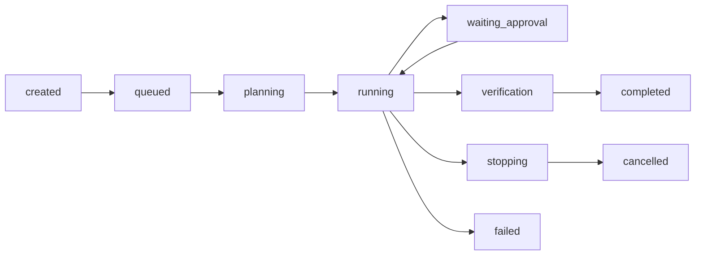

# Task Lifecycle and Interruption

This document explains how Apex models task progress, interruption, resume, and safe incomplete states.

It is a companion to:

- [`../master_plan.md`](../master_plan.md)
- [`./architecture-document-system.md`](./architecture-document-system.md)
- [`./verification-and-completion.md`](./verification-and-completion.md)

## 1. Purpose

Tasks in this platform are not one-shot prompts.

They are first-class runtime objects with:

- status
- plan
- checkpoints
- artifacts
- audit
- interruption controls

This makes them suitable for:

- one-off tasks
- long-running tasks
- recurring tasks
- scheduled tasks
- unattended long-running work

## 2. Core Principle

All meaningful work should be modeled as a task.

That is how the platform keeps work:

- stoppable
- resumable
- auditable
- verifiable

## 3. Supported Task Types

### 3.1 One-Off

Single task run with a bounded objective.

### 3.2 Long-Running

Task may span multiple stages, tool calls, or extended runtime.

### 3.3 Recurring

Task pattern repeats regularly.

### 3.4 Scheduled

Task is triggered according to a schedule and may require owner review.

## 4. Standard Lifecycle

This is the baseline lifecycle.

## 5. Planning

During planning the runtime should:

- establish or reuse definition of done
- infer capability needs
- resolve reusable capabilities
- reuse learned templates when appropriate
- build or reuse the execution plan

Planning should be fast when prior successful methods exist.

## 6. Running

During execution the runtime should:

- emit heartbeats
- update checkpoints
- produce artifacts
- record worker runs
- record tool invocations

Execution must remain observable.

## 7. Verification

Execution does not end the task.

After execution, the task still needs:

- checklist
- verifier
- reconciliation
- done gate

Only then may it move to `completed`.

## 8. Interruption Model

The platform must support interruption as a first-class feature.

Users should be able to:

- stop a task
- resume a task when supported

The runtime should not treat interruption as an exceptional edge case.

The equally important best-practice rule is:

- the runtime should keep working without human intervention whenever the next step is well-defined, safe, and policy-allowed

## 9. Stop Behavior

When a task is stopped:

- status should move through a stopping state
- worker runs should be updated
- audit should record the stop
- partial artifacts should remain visible
- the task must not be marked complete

Stopping should be safe and explicit.

## 10. Resume Behavior

When a task is resumed:

- status should reflect the resume transition
- execution should continue from the most recent safe point where possible
- heartbeats should resume
- verification is still required before completion

Resume is not a shortcut around validation.

## 11. Checkpoints

Checkpoints are critical for safe interruption and recovery.

They should record meaningful stages such as:

- planning fast path
- execution started
- execution completed
- verification milestones

Checkpoints allow the system and the user to understand where a task left off.

## 12. Watchdog

The watchdog exists to detect stalled tasks.

It should look for:

- missing heartbeat
- stale heartbeat
- lack of progress

This prevents long-running tasks from silently hanging forever.

## 12A. Autonomous Completion

Long-running tasks should be designed for autonomous completion.

The runtime should continue until:

- the definition of done is satisfied
- the user explicitly stops the task
- a hard policy boundary blocks progress
- a real human-judgment boundary is reached

To support this, the runtime should provide:

- checkpoint recovery
- bounded retries
- backoff
- degraded fallback where safe
- explicit escalation when human judgment is required

Autonomy does not mean uncontrolled behavior.
It means the runtime should not need babysitting for well-bounded work.

## 13. Partial and Incomplete States

Not all non-completed tasks are the same.

The runtime should distinguish clearly between:

- draft artifacts
- partial artifacts
- ready artifacts
- cancelled tasks
- failed tasks
- paused or resumed tasks

This clarity is important because interruption should not destroy observability.

## 14. Scheduled and Recurring Tasks

Scheduled and recurring tasks follow the same underlying lifecycle, but with an additional scheduling layer.

Important rules:

- each run should still be a first-class task
- completion must still go through verification
- schedule presence does not waive verification
- schedule-driven tasks may require owner review

For recurring background summarization and consolidation:

- it must be opt-in
- it must be budget-capped
- it must be reviewable
- it must not silently burn tokens forever

## 15. Why This Matters

Without a strong task lifecycle model:

- tasks cannot be trusted
- stop and resume become unsafe
- long-running execution becomes opaque
- recurring tasks become harder to audit

The task object is therefore the core operational primitive.

## 16. Summary

The lifecycle and interruption model is what makes the platform operationally usable rather than merely conversational.

In one sentence:

`Apex treats every meaningful unit of work as a lifecycle-managed, interruptible, auditable task that must still pass verification before completion.`
