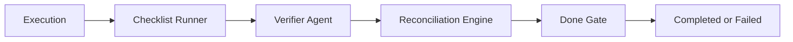

# Verification and Completion

This document explains how Apex decides whether a task is actually complete.

It is a companion to:

- [`../master_plan.md`](../master_plan.md)
- [`./architecture-document-system.md`](./architecture-document-system.md)
- [`../README.md`](../README.md)
- [`./reuse-and-learning.md`](./reuse-and-learning.md)

## 1. Purpose

The platform is explicitly verification-driven.

That means:

- execution does not equal completion
- artifact creation does not equal completion
- a model saying "done" does not equal completion

A task is only complete when it passes the formal completion stack.

## 2. Why This Exists

Without a formal completion model, agent systems fail in predictable ways:

- they stop too early
- they silently skip required steps
- they produce plausible output that does not actually satisfy the task
- they confuse "generated text" with "real-world completion"

The verification stack exists to prevent those failure modes.

## 3. Completion Model

Each task should end with one of two sources of completion truth:

### 3.1 User-Defined Completion

If the user provided explicit requirements, those are authoritative unless explicitly waived.

### 3.2 System-Generated Definition of Done

If the user did not define completion, the runtime generates a usable `Definition of Done` before execution.

This draft should be based on:

- department
- task type
- risk level
- known playbooks
- prior successful cases
- organization policy

## 4. Completion Stack

The intended completion path is:

Each layer has a different job.

Boundary note:

- the sequence above is the explanatory baseline and still matches the current repository shape
- the stricter best-practice target is evidence-driven completion, where checklist, verifier, reconciliation, and policy outcomes all feed an `Evidence Graph` and `Completion Engine`
- this means the sequence is useful for explanation, but not the only correct future execution topology

## 5. Checklist Runner

The checklist runner verifies explicit required items.

Examples:

- required artifacts exist
- mandatory steps were completed
- required owner checks were performed
- mandatory auto-check items passed

Checklist is best for:

- deterministic requirements
- structural completeness
- artifact presence

Checklist is not enough by itself.

## 6. Verifier Agent

The verifier agent performs semantic review.

It answers questions like:

- is the output actually aligned with the task intent
- is the result complete rather than merely present
- are there obvious quality or policy issues
- are there remaining missing items

The verifier should not replace deterministic checks.
It should complement them.

## 7. Reconciliation Engine

The reconciliation engine checks real-world or external-state truth.

Examples:

- did the CRM update really land
- did the file really get written
- did the expected artifact reach `ready`
- did the target system actually reflect the intended state

This prevents the platform from treating "attempted action" as "completed action."

## 8. Done Gate

The done gate is the final completion authority.

It should decide completion only after inspecting:

- checklist result
- verifier result
- reconciliation result
- policy conditions

If any critical part fails, the task does not enter `completed`.

## 9. What Completion Means in Practice

The runtime should only mark a task complete when:

- required artifacts exist
- required checks pass
- reconciliation passes
- verifier returns a passing verdict
- no blocking policy issue remains

This is a hard rule.

## 10. Stop, Pause, Resume, and Partial Output

The platform must also handle incomplete endings safely.

### 10.1 Stop

If the user stops a task:

- status should reflect the interruption
- partial artifacts should be retained according to policy
- audit should record the stop
- the task should not be falsely completed

### 10.2 Resume

If the task supports resume:

- resume should continue from a safe checkpoint
- verification should still run before completion

### 10.3 Partial Output

Partial output should be visible but clearly marked.

The system must not confuse:

- `partial`
- `draft`
- `ready`

## 11. Verification and Speed

The system is allowed to get faster by:

- reusing learned playbooks
- reusing task templates
- reducing repeated exploration

It is not allowed to get faster by:

- skipping checklist
- skipping verifier review
- skipping reconciliation
- skipping done gate

This is the key optimization boundary.

## 12. Verification and Learning

Learning should only promote strong reusable assets from trustworthy task outcomes.

The intended path is:

1. task finishes execution
2. verification stack passes
3. methodology is captured
4. learned skill is promoted or updated
5. task template is promoted or updated

This means verification gates not only completion, but also future reuse quality.

## 13. Failure Handling

If the completion stack fails:

- the task should remain not complete
- the user should see why
- rerun scope should be clear
- the platform should preserve artifacts, logs, and checkpoints for recovery

Common failure outcomes:

- missing artifact
- failed reconciliation
- verifier missing item
- policy issue

## 13A. Rollback and Compensation

Some failures are not just incomplete; they are partially executed side effects.

The platform should distinguish between:

- safe retry
- safe rollback
- compensation required
- human takeover required

Best-practice progression:

1. make critical actions idempotent
2. store enough execution evidence to reconcile actual state
3. support compensating actions for reversible operations
4. require human review for irreversible or high-risk partial failure

For local file-side effects in the current desktop runtime, this means:

- write and patch operations should emit an idempotency key
- overwriting operations should preserve backup evidence
- rollback should restore from retained backup artifacts instead of guessing prior state

Verification is not only about checking outputs.
It must also help determine whether recovery is safe.

## 14. User-Facing Visibility

The task workspace should show:

- checklist status
- verifier verdict
- reconciliation status
- done gate result
- reasons for failure

This is important because completion should be visible, not hidden.

## 15. Operational Guidance

Use deterministic validation whenever possible.

Recommended order of trust:

1. direct state check
2. deterministic checklist item
3. verifier semantic review
4. human review for high-risk cases

The verifier is valuable, but it should not be the only source of truth.

## 16. Summary

The completion model is designed to ensure that:

- tasks do not finish early
- outputs are not mistaken for completion
- external state is checked
- learning is only promoted from trustworthy outcomes

In one sentence:

`Apex only treats work as complete after deterministic checks, semantic verification, reconciliation, and final done-gate approval agree.`
