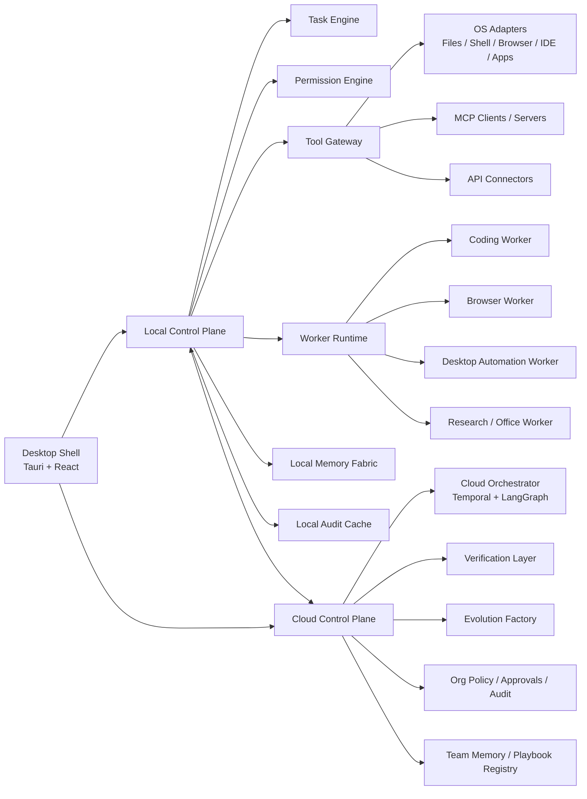
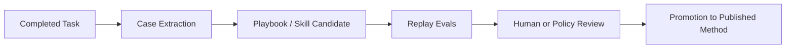
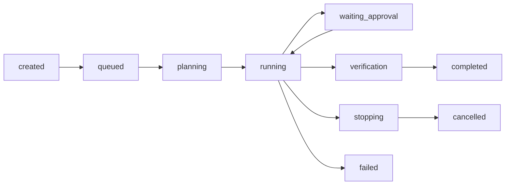

# Apex Master Plan

## 1. Document Status

This file is the canonical master plan for the final product.

- It supersedes fragmented or iterative architecture notes in `plan.md`.
- `plan.md` remains useful as design history and exploration context.
- For implementation, roadmap, product decisions, and architecture review, use this file as the primary reference.
- For the focused document map, also see `docs/index.md`.
- For the current implementation status and implemented-vs-planned boundary, also see `docs/current-architecture-status.md`.
- For the mandatory architecture rules every contributor and agent must obey, also see `docs/architecture-constitution.md`.
- For document authority order, terminology normalization, and current-vs-target truth discipline, also see `docs/architecture-document-system.md`.
- For the detailed adoption guide for external best practices, also see `docs/external-pattern-adoption.md`.
- For the detailed learning and reuse mechanism, also see `docs/reuse-and-learning.md`.
- For the detailed verification and completion model, also see `docs/verification-and-completion.md`.
- For the detailed local permission and tooling model, also see `docs/local-permission-and-tooling.md`.
- For the desktop workspace interaction model, also see `docs/desktop-workspace-ui.md`.
- For capability discovery and reuse behavior, also see `docs/capability-discovery-and-reuse.md`.
- For lifecycle, stop, and resume behavior, also see `docs/task-lifecycle-and-interruption.md`.
- For the non-compatibility-constrained best-practice reset plan, also see `docs/best-practice-reset-plan.md`.
- For contract boundaries, also see `docs/api-contracts.md`.
- For the entity and persistence model, also see `docs/data-model.md`.
- For deployment guidance, also see `docs/deployment-and-environments.md`.
- For observability and operations, also see `docs/observability-and-operations.md`.
- For the phased runtime hardening and improvement roadmap, also see `docs/runtime-improvements-roadmap.md`.
- For local settings, runtime defaults, and default-directory behavior, also see `docs/local-settings-and-runtime-defaults.md`.
- For multi-agent governance, acceptance-agent boundaries, and task budget enforcement, also see `docs/multi-agent-governance-and-budgeting.md`.

Important boundary:

- this document mixes:
  - the final target architecture
  - the current implementation direction
- when there is a difference, the current repository code is authoritative for "what exists now", while this file is authoritative for "what the final product should converge toward"
- when there is a difference between this file and `docs/best-practice-reset-plan.md` on final-state architecture shape, treat the best-practice reset plan as the stricter target for future redesign
- for current implementation detail, the most precise references are:
  - `README.md`
  - `docs/api-contracts.md`
  - `docs/data-model.md`
  - `docs/runtime-improvements-roadmap.md`

## 2. Final Product Definition

The final product is:

`a local-first, cloud-augmented, verification-driven, self-evolving Universal Agent Desktop`

This means:

- `local-first`
  - it can operate the user's computer directly
- `cloud-augmented`
  - cloud services enhance governance, long-running orchestration, team collaboration, and policy
- `verification-driven`
  - work is not considered complete until it passes formal completion gates
- `self-evolving`
  - completed work can be distilled into reusable skills, playbooks, and methodology

The product is not only a chat app.
It is a full task operating system for humans and AI workers.

## 3. Product Goals

The final app must be able to:

- act like Codex or Claude Code on a local machine
- orchestrate one-off, long-running, recurring, and scheduled tasks
- support personal, team, and enterprise deployment modes
- control local tools, files, shell, browser, IDE, and desktop software when explicitly permitted
- integrate with external systems using standardized protocols
- verify completion before declaring a task done
- preserve auditability, interruption, recovery, and policy control
- learn from completed tasks and promote proven methods into reusable assets
- continue long tasks unattended until completion, explicit stop, or a real safety or judgment boundary

## 4. Non-Negotiable Design Principles

- `Task-first`
  - every meaningful operation must map to a task
- `Local-first`
  - direct computer control lives locally, not only in the cloud
- `Cloud-augmented`
  - long-running orchestration, shared memory, approvals, policy, and fleet functions belong in the cloud control plane
- `Verification-driven`
  - no task is complete without formal validation
- `Least-privilege`
  - permissions are minimal by default
- `Interruptible`
  - all tasks must support stop, resume, retry, and checkpointing where possible
- `Auditable`
  - every critical action must be recorded
- `Constitution-driven`
  - every contributor, agent, skill, and worker must obey the same architectural rulebook
- `Composable`
  - Skills, MCP, Workers, Tools, and Workflows must compose rather than replace each other
- `Deterministic-first`
  - prefer CLI, scripts, and existing tools before spending model reasoning on fixed workflows
- `No silent egress`
  - code, prompts, logs, memory, and artifacts must not be silently sent to third-party systems
- `Speed by reuse`
  - the platform should prefer fast-path reuse of proven methods, templates, and capabilities before generating new plans or implementations
- `Vendor-neutral`
  - the platform must not be locked to a single model, runtime, or connector style
- `Self-evolving but governed`
  - the system can improve itself, but only through controlled promotion paths

## 5. Product Modes

### 5.1 Personal Mode

- local-first
- can run without cloud services
- suitable for developers, researchers, analysts, and power users

### 5.2 Team Mode

- local clients plus shared cloud control plane
- team memory, playbooks, approvals, and audit aggregation

### 5.3 Enterprise Mode

- organization-wide governance
- SSO, fleet management, device policy, approval policy, audit export, compliance support

## 6. Canonical Architecture

## 7. Responsibilities by Layer

### 7.1 Desktop Shell

Responsibilities:

- task workspace UI
- conversation UI
- approvals and notifications
- settings and permissions UI
- runtime defaults and budget-control UI
- artifact viewing
- task control actions

Must not own:

- core orchestration logic
- final completion decisions
- policy enforcement logic

### 7.2 Local Control Plane

Responsibilities:

- maintain local task state
- route local tool calls
- manage local workers
- derive effective runtime defaults from local settings
- own stop, resume, retry, and checkpoint behavior
- cache local audit and state when offline
- mediate between UI and cloud services
- expose real local adapters behind permission checks

The first production-grade local adapters should be:

- read-only workspace directory listing
- read-only file access
- confirmation-gated workspace-scoped file writes with backup artifact capture
- confirmation-gated exact-match patching for safer file edits
- confirmed read-only shell execution
- low-risk browser snapshots for QA and validation tasks
- reusable browser sessions with audited navigation history
- confirmation-gated IDE workspace summaries for engineering context gathering

This is the heart of the local app.

### 7.3 Worker Runtime

Responsibilities:

- execute delegated work
- produce artifacts
- emit checkpoints and telemetry
- obey permissions and interruption rules
- obey supervisor-issued context envelopes, task budgets, and delegation limits

Recommended worker types:

- coding worker
- browser worker
- shell worker
- desktop automation worker
- research worker
- office/document worker

### 7.4 Cloud Control Plane

Responsibilities:

- durable long-running orchestration
- shared team memory
- team and enterprise approvals
- org policy packs
- fleet management
- audit aggregation
- model routing and evaluation services

### 7.5 Verification and Evolution Layer

Responsibilities:

- checklist evaluation
- acceptance-agent semantic review
- reconciliation with real-world state
- final done gate
- methodology extraction
- playbook evaluation and promotion

## 8. Final Positioning of Core Technologies

### 8.1 LangGraph

Keep it.

Final role:

- stateful orchestration kernel for complex tasks
- human-in-the-loop coordination
- interrupt and resume aware flows
- subgraph orchestration

Do not use it as:

- desktop shell
- permission engine
- whole product backbone by itself

Current repository status:

- `LangGraph` is not yet integrated into the current codebase
- there is no `LangGraph` runtime dependency in the current monorepo manifest
- there is no live `LangGraph` orchestration graph in the current local control plane or shared runtime packages
- in the current repo state, `LangGraph` remains a reserved future choice for the cloud orchestrator layer rather than a dependency already used in production code

Current implementation reality:

- the runnable implementation today is a custom typed runtime centered on:
  - `packages/shared-runtime`
  - `packages/shared-local-core`
  - `apps/local-control-plane`
  - `apps/desktop-shell`
- task orchestration currently happens through explicit contracts, state transitions, verification flows, capability resolution, delegated runtime lifecycle objects, and local control-plane APIs
- if the team later adopts `LangGraph 2.x`, it should be introduced behind the cloud orchestrator boundary rather than woven through desktop, permission, memory, or tool-safety layers

### 8.2 DeerFlow

Keep it, but move it down a layer.

Final role:

- heavy-duty expert runtime for long, complex execution
- suitable for:
  - deep research
  - long coding tasks
  - multi-step exploration
  - heavy report generation
  - advanced test generation and execution

Do not use it as:

- total app skeleton
- governance layer
- enterprise control plane

### 8.3 MCP

Keep it.

Final role:

- standardized external tool and resource protocol
- stable connector layer between agent runtimes and systems

Use it for:

- GitHub
- Slack / Feishu / Teams
- Docs / Drive
- Figma
- internal services
- databases

### 8.4 Skills

Keep them.

Final role:

- reusable methodology
- prompt templates
- task recipes
- SOPs
- output conventions

Skills answer:

- how should a type of task be approached
- what good output looks like
- which conventions apply

### 8.5 Workers

Keep them as execution units.

Final role:

- carry out specialized work
- report status and artifacts
- remain replaceable and bounded

### 8.6 Verification Stack

Keep it exactly as a first-class differentiator.

Final role:

- `Checklist Runner`
  - checks required steps and mandatory deliverables
- `Verifier Agent`
  - evaluates semantic quality and completeness
- `Reconciliation Engine`
  - confirms external state or actual execution results
- `Completion Engine / Done Gate`
  - makes the final completion decision

### 8.7 Local Persistence

Keep it local-first and replaceable.

Final role:

- persist local task, artifact, audit, checkpoint, and memory state across restarts
- allow offline operation without requiring cloud infrastructure
- stay abstracted behind a repository boundary so the driver can change later

Best-practice default:

- local control plane: `SQLite`
- cloud control plane: `Postgres`
- future sync-friendly upgrade path: `libSQL / Turso embedded replica`

Do not:

- bind app logic directly to one SQLite driver API
- leave local state as process memory only
- use the local desktop database as the organization-wide source of truth

### 8.8 Capability Discovery

Keep it as a platform rule.

Final role:

- when a task needs a Skill, MCP server, Tool, or Worker, search first
- reuse or compose existing capabilities whenever they satisfy the need
- fall back to local implementation only when search fails or the result is insufficient

The permanent precedence rule is:

1. search for reusable `Skill`
2. search for reusable `MCP` connector or standardized resource access
3. search for reusable `Tool`
4. search for reusable `Worker`
5. if none satisfy the task, implement locally under audit and verification

## 9. Skill, MCP, Tool, Worker Relationship

This is a permanent rule:

- `Skill`
  - how to do the work
- `MCP`
  - what systems and resources can be accessed in a standardized way
- `Tool`
  - the concrete callable capability
- `Worker`
  - who performs the work
- `Workflow`
  - how the whole task is sequenced

In one sentence:

`Skill defines the method, MCP exposes access, Worker performs execution, Workflow coordinates the whole task.`

## 10. Local-First and Cloud-Augmented Unified Model

These are not contradictory.

The final interpretation is:

- the local app handles direct computer control
- the cloud enhances governance, orchestration, shared memory, approvals, and fleet-level visibility

In practice:

- without the local layer, you cannot truly manage the user's computer
- without the cloud layer, you cannot truly scale to team and enterprise usage

## 11. User Interaction Model

The final product should not be a plain chatbot.

The user interacts through:

- a desktop app
- a task workspace
- a conversation side panel
- approval cards
- notifications
- optional enterprise messaging channels

### 11.1 Primary Navigation

- `Tasks`
- `Automations`
- `Approvals`
- `Artifacts`
- `Skills / Playbooks`
- `Connectors / MCP`
- `Workers`
- `Audit / Cost / Observability`
- `Settings`

### 11.2 Task Detail Page

Every task page should show:

- task objective
- definition of done
- execution plan
- current status
- current worker
- checkpoints
- artifacts
- checklist / reconciliation / verification / done gate
- approvals
- audit trail
- cost and duration
- memory and methodology output

### 11.3 Conversation Panel

The conversation panel is an auxiliary interface for:

- clarifying intent
- refining requirements
- requesting rework
- asking for explanations
- initiating partial reruns

It is not the only place where the user understands system state.

## 12. Cross-Platform Strategy

The app must support:

- Windows
- macOS
- Linux

Best practice:

- primary form factor: desktop app
- primary logic location: local control plane plus optional cloud services
- avoid OS-specific behavior in core product logic
- isolate OS differences in adapter layers

### 12.1 Recommended Desktop Stack

- desktop shell: `Tauri` first
- use `Electron` only when Tauri cannot satisfy concrete integration requirements

### 12.2 OS-Specific Differences to Isolate

- filesystem paths
- shell semantics
- line endings and encoding
- notification mechanisms
- application discovery
- permission prompts
- browser automation environments

## 13. Third-Party Software Integration Strategy

Use the following order of preference:

### 13.1 API-first

Preferred whenever possible.

Examples:

- SaaS APIs
- internal service APIs
- webhook systems
- MCP-accessible tools and resources

### 13.2 Browser automation second

Use when:

- the system has a web UI but incomplete APIs
- UI testing is needed
- data extraction is needed

### 13.3 Local application control third

Use only when necessary.

Examples:

- legacy desktop software
- local-only tools
- internal Windows apps with no API

This mode has the highest risk and highest maintenance cost.

## 14. Permission Model

Permissions must be governed at three levels.

### 14.1 Platform Permissions

Control:

- who can create tasks
- who can stop or resume tasks
- who can approve actions
- who can see artifacts, audit, and cost data

### 14.2 System Permissions

Control:

- what connectors and tools a task may access
- what actions require approval
- what departments can use what capabilities

### 14.3 Local Machine Permissions

Control:

- file read and write
- shell execution
- browser control
- local application invocation
- IDE integration

Rules:

- default to denied
- elevate explicitly
- scope by task, device, and user
- record every critical action

## 15. Local Worker Architecture

Local Workers are optional execution extensions for machine control.

Each Local Worker should declare:

- `device_id`
- `user_id`
- `os_type`
- `worker_version`
- `capabilities`
- `granted_permissions`
- `tool_whitelist`
- `last_seen_at`

Example capabilities:

- `local_files.read`
- `local_files.write`
- `local_shell.execute`
- `local_browser.automate`
- `local_ide.control`
- `local_app.invoke`

Local Workers must support:

- registration
- identity binding
- capability advertisement
- secure command channel
- audit return path
- revocation and disablement

## 16. Memory Fabric

Memory must be layered.

### 16.1 Session Memory

- current task context
- current conversation
- temporary scratchpad

### 16.2 Fact Memory

- structured business or machine facts
- stable references
- local or cloud structured state

### 16.3 Semantic Memory

- documents
- reports
- searchable unstructured history

### 16.4 Methodology Memory

- skills
- playbooks
- SOPs
- output templates
- task templates
- verification rubrics

### 16.5 Evaluation Memory

- records of which methods worked best for which task families

Rule:

Do not collapse all memory into a vector store.

## 17. Self-Evolution Model

The system must learn, but never mutate itself silently.

### 17.1 Evolution Pipeline

### 17.2 Promotion Outputs

Completed tasks may generate:

- case records
- playbook candidates
- skill candidates
- task templates
- verification rubric templates
- checklist templates
- reconciliation templates

### 17.3 Guardrails

- no unreviewed silent promotions for high-impact capabilities
- no policy changes from a single example
- no direct privilege expansion through self-evolution
- no unbounded memory growth from near-duplicate experiences; similar successful tasks must merge into compact reusable entries when possible

## 17A. Performance and Fast-Path Reuse

The platform should optimize for lower latency and lower repeated exploration cost without weakening verification or safety.

### 17A.1 Permanent Performance Rules

- prefer reuse before generation
- prefer compact templates before full replanning
- prefer one strong capability over composing many weak ones
- prefer local cached state for task workspace rendering and recent history
- prefer incremental updates over rebuilding every task view from scratch
- keep verification strict, but avoid rerunning unnecessary planning work

### 17A.2 Fast Planning Path

For a new task:

1. infer the task family
2. search for matching learned playbooks
3. search for matching task templates
4. if a strong template exists, reuse:
   - definition of done
   - baseline execution plan
   - expected artifact pattern
5. still run capability discovery to confirm the currently available Skill, MCP, Tool, and Worker landscape
6. only generate a fresh plan when no strong reusable template exists

### 17A.2A Local Similarity Retrieval

Before introducing heavyweight semantic infrastructure, the local-first app should use a fast, explainable retrieval layer that ranks prior successful assets by:

- intent token overlap
- department and task-type alignment
- applicability-rule fit
- version
- successful support count
- recent successful reuse

This keeps the desktop runtime:

- fast
- offline-friendly
- explainable
- small in storage footprint

The recommendation output should be visible in the task workspace so users can inspect:

- which learned playbooks matched
- which task templates matched
- the ranking score
- the applicability rules
- the recorded failure boundaries

Heavier semantic retrieval can be added later, but should augment this layer rather than replace basic fast local ranking for repeated operational tasks.

### 17A.3 Compact Learning Strategy

To prevent storage explosion while preserving speed gains:

- merge methodology entries by task fingerprint
- merge approved learned skills by task fingerprint
- merge task templates by task fingerprint
- increment evidence counts instead of cloning whole records
- keep compact summaries and bounded evidence lists
- store the number of supporting successful tasks so stronger methods rank higher

### 17A.4 Speed Without Sacrificing Correctness

The app must never trade away:

- permission checks
- audit records
- checklist evaluation
- reconciliation
- verifier review
- done gate decisions

The intended optimization boundary is:

- planning should become faster
- capability reuse should become faster
- repeated exploration should become rarer
- completion standards must remain intact

## 17B. Risk Hardening and Reliability Reinforcements

The platform must explicitly defend against the most common agent-system failure modes.

### 17B.1 Do Not Treat the Agent Like a Plain Backend

The runtime must keep:

- structured planning
- a task state machine
- explicit checkpoints
- explicit capability selection
- explicit completion and reconciliation

The minimum planning model is:

- `plan`
- `action`
- `observation`
- `reflect`

The minimum task state model is:

- `created`
- `queued`
- `planning`
- `running`
- `waiting_approval`
- `verification`
- `stopping`
- `completed`
- `failed`
- `cancelled`

### 17B.2 Runtime Stability Controls

The product must include:

- parameter validation before tool execution
- permission validation before tool execution
- per-task mutation locks for state-changing operations
- local rate limiting and backpressure at the control-plane edge
- retry policy for transient failures
- timeout policy for long-running tool calls
- fallback strategy when a preferred capability is unavailable
- future circuit-breaker policy for unstable connectors or model routes

Concurrency is not free.
The app must prefer controlled scheduling over unbounded parallelism.

### 17B.3 Security Reinforcements

The product must explicitly defend against:

- prompt injection
- privilege-bypass attempts
- tool-call shaping attacks
- memory poisoning
- unreviewed promotion of unsafe learned assets

Minimum mandatory controls:

- task-creation security preflight
- methodology sanitization before memory promotion
- rejection of unsafe learned skills for automatic approval
- least-privilege local tooling
- no automatic privilege escalation
- full auditability for critical actions
- human review for high-risk operations

### 17B.4 Delivery and Production Readiness

The product must not stop at demo quality.

It must provide:

- reproducible task runs
- replayable verification evidence
- observability and alerting
- manual takeover paths
- comparative evaluation against simpler baselines

Minimum north-star metrics:

- completion success rate
- verification pass rate
- manual intervention rate
- fallback rate
- reuse hit rate
- average time to completion
- token and tool cost
- security-flag rate
- hallucination rate where measurable

### 17B.5 Rollback and Compensation

Where external or local side effects exist, the product should move toward:

- idempotent actions
- compensating actions
- external-state reconciliation
- partial-failure visibility

The final rule is:

- the system may attempt recovery automatically for safe reversible operations
- the system must escalate to human review for irreversible or high-risk side effects

## 18. Task Lifecycle

The platform must support:

- one-off tasks
- long-running tasks
- recurring tasks
- scheduled tasks

### 18.1 Standard Lifecycle

### 18.2 Required Features

- checkpoints
- heartbeats
- stop
- resume
- retry
- audit trail
- artifact manifest
- verification before completion

## 19. Completion Model

The platform must support both cases:

- when the user gives explicit completion criteria
- when the user does not give explicit completion criteria

### 19.1 If User Defines Completion

The task must end only when those criteria are satisfied or explicitly waived.

### 19.2 If User Does Not Define Completion

The system must generate a draft `Definition of Done` before execution.

Sources:

- task type
- department
- risk level
- known playbooks
- past similar cases
- product policy

### 19.3 Final Completion Stack

The recommended completion order is:

1. mandatory checklist
2. verifier review
3. reconciliation
4. done gate decision

## 20. Data Model Highlights

The minimum first-class objects are:

- `Task`
- `Task Run`
- `Worker Run`
- `Artifact`
- `Checkpoint`
- `Audit Entry`
- `Schedule`
- `Memory Item`
- `Skill Candidate`
- `Verification Result`
- `Checklist Result`
- `Reconciliation Result`
- `Done Gate Result`

These should remain product-level concepts, not hidden implementation details.

## 21. Recommended Technology Stack

### 21.1 Desktop

- Tauri
- React
- TypeScript

### 21.2 Local Core

- Rust or Go
- SQLite

### 21.3 Cloud Core

- Temporal
- LangGraph
- Postgres
- object storage
- queue / event infrastructure

### 21.4 Tooling Layer

- MCP
- API connectors
- browser automation
- local adapters

### 21.5 Model Layer

- multi-provider model gateway
- structured output and tool-calling support
- provider fallback and cost routing

## 22. Anti-Patterns to Avoid

- making the product only a chat UI
- binding the whole system to one model vendor
- letting DeerFlow become the whole product skeleton
- treating Skills as a replacement for MCP
- treating MCP as a replacement for playbooks
- letting workers define their own permission semantics independently
- declaring tasks complete without formal verification
- storing all memory in one undifferentiated vector layer
- giving blanket machine control by default
- relying on local UI automation where APIs are available

## 23. Implementation Sequence

### Phase 1. Local-First MVP

Build:

- desktop shell
- local control plane
- task engine
- basic permission engine
- file, shell, browser, and IDE adapters
- worker adapter
- artifact, checkpoint, and audit pipeline
- minimum verification loop

Minimum Phase 1 tool adapter policy:

- file system starts read-only
- file writes only open after explicit confirmation, workspace scoping, audit capture, and backup artifact generation
- file patching should prefer exact-match edits so the runtime can refuse stale or ambiguous local modifications
- shell starts read-only and confirmation-gated
- browser access starts with snapshot-style validation flows and only defaults to allow for QA-oriented use cases
- browser sessions must persist locally so later navigation can reuse prior context without bypassing audit or permission gates
- browser sessions should prefer a real browser worker when available and degrade to safe snapshot capture when the richer runtime is unavailable
- IDE access starts with read-only workspace summaries and remains confirmation-gated until richer policy controls are proven stable
- learned experience should be promoted into compact knowledge entries and reusable skills/playbooks, with fingerprint-based merging to avoid storage explosion
- local write adapters arrive only after permission, audit, and checkpoint rules are proven stable

### Phase 2. Cloud-Augmented Team Mode

Build:

- cloud control plane
- team memory sync
- approvals
- audit aggregation
- schedule management
- long-running orchestration

### Phase 3. Verification and Evolution Upgrade

Build:

- stronger verifier and reconciliation
- evolution factory
- playbook promotion workflow
- team-visible methodology registry

### Phase 4. Enterprise Governance

Build:

- SSO
- fleet management
- policy packs
- compliance exports
- org-wide risk controls

### Phase 5. Runtime Hardening and Teams

Build:

- explicit session / harness / sandbox contracts
- context compaction and promoted memory summaries
- stronger reuse-improvement feedback into learned assets
- subagent session contracts and team orchestration scaffolding
- harder sandbox boundaries for risky local execution
- optional cloud control-plane synchronization paths

## 24. Final Decision Summary

The final app should:

- keep your current verification-heavy enterprise architecture strengths
- keep LangGraph for orchestration
- keep DeerFlow as a heavy expert worker runtime
- keep MCP for standardized system access
- keep Skills for methodology
- move the product into a local-first desktop form factor
- add a local control plane and local workers for real computer control
- preserve cloud augmentation for governance, long-running tasks, and team intelligence

In one sentence:

`The final app is a Universal Agent Desktop that combines local computer control with cloud orchestration, formal verification, governed self-evolution, and enterprise-grade safety.`

## 25. Capability Discovery and Fallback Policy

The app must treat capability discovery as part of planning, not as an afterthought.

For every meaningful task:

- infer capability needs from:
  - task intent
  - department
  - task type
  - explicit user-requested capabilities
- search the capability catalog before execution
- record the chosen strategy in task state
- show the decision in the task workspace

Each need must end in one of three strategies:

- `reuse_existing`
  - one existing capability is sufficient
- `compose_existing`
  - multiple existing capabilities together satisfy the need
- `implement_local`
  - no reusable option is good enough, so the local runtime implements the missing path

This policy applies equally to:

- Skills
- MCP servers
- local tools
- local workers
- cloud workers

The capability discovery decision must be:

- auditable
- visible in the task workspace
- persisted locally
- safe to re-run

The capability search result is not the final authority by itself.
It still flows into:

- permission checks
- execution
- verification
- reconciliation

The concrete Phase 1 implementation pattern is:

- try reusable Skill guidance first
- then reusable MCP or connector access
- then reusable local tool adapters such as filesystem, shell, browser snapshot, or IDE workspace summary
- then reusable workers
- only then create a new local implementation path under audit, artifact capture, and verification
- done gate

## 26. Learned Knowledge, Skills, and Templates

Completed tasks should not only produce artifacts. They should produce reusable operational knowledge.

### 26.1 What Gets Learned

For successful task families, the platform should distill:

- compact methodology memory
- approved learned skills or playbooks
- compact task templates for fast planning reuse

### 26.2 What Task Templates Contain

Each task template should keep only the reusable planning core:

- task fingerprint
- department
- task type
- version
- definition of done
- baseline execution plan
- applicability rules
- failure boundaries
- ranking tags
- support count from successful prior tasks

Task templates should not store:

- full raw transcripts
- unbounded artifact bodies
- duplicated historical notes

### 26.3 How Learned Assets Are Reused

When a new task arrives:

1. capability discovery checks approved learned skills
2. planning checks learned task templates
3. if a template is a good match, the task reuses it as a planning fast path
4. execution still verifies currently available capabilities
5. completion still requires the full verification stack

### 26.4 Why This Matters

This allows the system to behave more like an experienced operator:

- the first hard task may require exploration
- later similar tasks should be materially faster
- the platform should improve in speed through governed reuse, not by skipping verification
- the platform should know when not to reuse a method because the applicability rules or failure boundaries no longer fit
